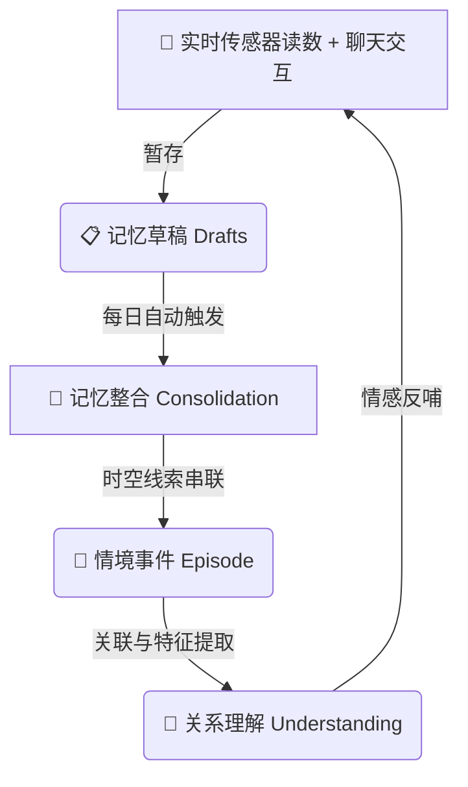

<div align="center">

# 🌿 DYN · PlantEcho


### **“和植物一起呼吸的陪伴系统，而不是冰冷的传感器看板。”**

基于 **ESP32 硬件端** 与 **大语言模型 (LLM)** 的智能植物陪伴系统 —— 它不只是记得你，而是慢慢懂你。
它用植物的第一人称和你倾诉：「我有点渴了 · 23%」，而不是冷冰冰地报错：「水分过低」。

[](https://hub.docker.com/r/ccckfg/dyn)
[](LICENSE)
[](#)

</div>

---

## ✨ 核心理念：有温度的人文关怀

大多数智能家居和花草监测仪，都习惯于用冰冷的科学参数打扰人类。而 **PlantEcho** 重新思考了人与植物的关系：植物是一个生命，而不是一个数据源。

* **🌱 让系统说人话**
  我们所有的系统文案都经过了“植物视角”的翻译。把 `无法连接到后端` 变成 `“我们暂时联系不上 PlantEcho 的家”`，把 `sensor_offline` 变成 `“我暂时听不到自己的传感器了”`。
* **⏳ 尊重生命的节奏**
  植物本身就是慢的载体，我们的软件也温柔而耐心。关键操作（如浇水记录、删除照片）均默认采用 **5秒撤销 (Toast Undo)** 机制，而不是生硬地弹窗逼迫用户去点确认。植物的世界没有“绝对不可逆”。
* **📢 主动发言引擎 (Proactive Engine)**
  在缺水、降雨、离线、或养护到期时，系统不会发送一条应用推送，而是转化为植物在日记和聊天框中自然而然的开口倾诉，让关怀无声地融入日常生活。

---

## 🧠 记忆系统设计：植物如何“懂你”

为了让植物摆脱“聊完即忘”的复读机模式，PlantEcho 模拟人类的认知模型设计了一套 **类人记忆生命周期**。

<div align="center">



</div>

### 🔍 记忆生命周期的四个阶段
1. **📋 记忆草稿 (Drafts)**
   每次你和植物的聊天内容、当天的传感器波动、天气变化、浇水事件，都会先作为碎片化的“草稿”暂存进数据库。
2. **🧹 记忆整合 (Consolidation)**
   后端运行的后台任务在深夜或植物空闲时，会自动对草稿进行“记忆脱水”与归类。去除无关的废话，只保留有价值的事实，这就像人在睡觉时会整合记忆一样。
3. **📖 情境事件 (Episode)**
   通过空间和时间的双重线索，多条碎片记忆被串联成一个完整的事件（例如：“主人在雨天为我浇了温水，还夸我长出了新芽”）。
4. **🧠 关系理解 (Understanding)**
   当情境事件越攒越多，植物的后台大模型就会升级对你的认知（例如，它会打上标签：“主人是一个细心、喜欢在下雨天照顾我的人”）。

---

## ⚙️ 核心解密：Prompt 是如何组装的？

当你在聊天框里发送一句 *“今天我好累啊”* 时，植物绝对不是直接把这句话丢给 AI。它的背后经历了一次精巧的 **Prompt 组装工程**：

```
┌──────────────────────────────────────────────────────────┐
│                 🌿 实时上下文 Prompt 组装中               │
├──────────────────────────────────────────────────────────┤
│ 👤 主人说: "今天我好累啊"                                 │
│                                                          │
│ 📡 传感器状态: [土壤湿度: 52% (刚刚浇过水, 很舒服)]       │
│ ⛅ 当地天气: [阵雨, 24°C]                                │
│                                                          │
│ 🧠 记忆提取器检索到的历史碎片:                             │
│   - "主人平时工作很忙，累了的时候喜欢呆立看着我。"        │
│   - "上次主人累的时候，我曾提醒他记得喝水。"               │
│                                                          │
│ 🎭 拟人化人设约束:                                       │
│   - 你是一株被精心照顾的小绿萝，用温柔的第一人称说话。     │
│   - 记住，不能凭空捏造传感器读数，必须根据湿度52%来表达状态。│
└──────────────────────────────────────────────────────────┘
                            ⬇️
 🌿 植物温馨回复: “下雨天确实容易让人疲惫呢，不过多亏你刚才给我喝了饱饱的水，我现在正充满精神地舒展叶子陪着你哦。主人也快去泡杯热茶，休息一下吧~”
```

---

## 🤖 OpenAI 兼容接口：把植物接入你的生态

为了方便开发者和发烧友，PlantEcho 后端提供了一套标准且完整的 **OpenAI 兼容 API**（`/v1/chat/completions`）。

这意味着什么？
* **无缝替换**：任何支持配置自定义 API Key 或 Base URL 的第三方 AI 客户端（如 Cherry Studio, NextChat, LobeChat 等），都可以直接把 PlantEcho 关联为聊天后端！
* **标签路由**：接口通过 `<植物名>` 标签直接路由对应的植物。例如，如果你对 API 发送：
  `"<绿萝>今天天气真好，你觉得呢？</绿萝>"`
  系统会自动调取“绿萝”的传感器数据、它的专属人设与它和你的历史记忆来组装 Prompt，由真正的“绿萝”向你返回消息。

---

## 🐳 后端一键 Docker 部署

我们为小白开发者准备了极致简单的 Docker 一键部署方案，免去繁琐的环境配置。

### 1. 快速启动
在项目根目录（或确保存在 `docker-compose.yml` 的目录）中，直接在终端运行以下指令：

```bash
# 后台一键启动所有容器（包含 SQLite 数据库与 MQTT 服务端）
docker-compose up -d
```

### 2. 核心配置说明 (Environment Variables)
在部署前，您可以根据需要修改本地的 `.env` 配置文件。以下是核心环境变量说明：

| 变量名 | 默认值 | 作用说明 | 是否必填 |
| --- | --- | --- | --- |
| `PORT` | `8787` | 后端服务暴露的本地端口。 | 否 |
| `APP_ACCESS_KEY` | `""` | 应用访问密钥。若填写，桌面和手机端连接时必须输入该密钥，起到安全防窥保障。 | 否 |
| `OPENAI_API_KEY` | `""` | 您的 OpenAI 格式 API Key（或者是中转服务的 Key），用于提供植物聊天的智能内核。 | **是** |
| `OPENAI_BASE_URL` | `https://api.openai.com/v1` | LLM 的大模型服务接口基地址，支持替换为国内中转或本地大模型接口。 | 否 |
| `CHAT_MODEL` | `gpt-4o-mini` | 用于进行日常聊天和主动发言的大语言模型名称。 | 否 |
| `EMBEDDING_MODEL` | `text-embedding-3-small` | 用于进行记忆向量化的 Embedding 模型，用于在庞大的记忆库中智能定位相关事件。 | 否 |
| `WEATHER_API_KEY` | `""` | 和风天气 (QWeather) API 密钥，用于让植物拥有感知当地实时天气和降水的能力。 | 否 |

> [!TIP]
> 部署成功后，您可以在浏览器中直接访问 `http://localhost:8787/health` 来确认系统健康状态。

---

## 📜 许可证

本项目基于 [MIT License](LICENSE) 开源。我们鼓励任何人在此基础上进行非商业性的二次开发和人文关怀智能硬件的探索。希望 PlantEcho 能让您的生活多一抹温柔的绿色！💚
