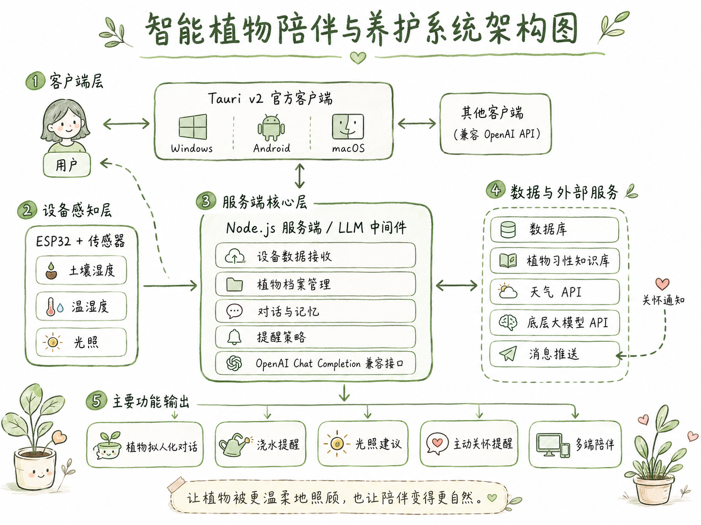

<div align="center">

# 🌿 PlantEcho

**和植物一起呼吸的陪伴软件，而不是一块传感器看板。**

*不只是记得你，而是慢慢懂你。*

[🌐 访问官方网站 (plant.ccckfg.com)](https://plant.ccckfg.com)

</div>

---

## 目录

- [它是什么](#它是什么)
- [架构一览](#架构一览)
- [设计哲学：让系统说人话](#设计哲学让系统说人话)
- [界面一览](#界面一览)
- [记忆系统：它像人一样回忆](#记忆系统它像人一样回忆)
- [Prompt 组装：植物怎么开口](#prompt-组装植物怎么开口)
- [主动发言引擎](#主动发言引擎)
- [OpenAI 兼容接口](#openai-兼容接口)
- [硬件（ESP32）](#硬件esp32)
- [完整搭建指南](#完整搭建指南)
  - [第一步：烧录硬件固件](#第一步烧录硬件固件)
  - [第二步：Docker 部署后端](#第二步docker-部署后端)
  - [第三步：选择客户端](#第三步选择客户端)
- [配置说明](#配置说明)
- [文档](#文档)

---

## 它是什么

PlantEcho 把一株植物的**环境感知、养护规则、长期记忆与拟人化对话**连成一个整体。

这个项目面向喜欢在家养植物的用户，想法挺简单——用传感器采集植物周围的环境数据，结合大语言模型，让植物"会说话"，以拟人化的方式提醒用户浇水、晒太阳、避光，让养植物这件事不只是定期打理，而是多一点陪伴感。

---

## 架构一览

<div align="center">

</div>

| 层 | 技术栈 | 职责 |
|---|---|---|
| **硬件层** | ESP32 · SHT40 · BH1750 · 电容式土壤传感器 | 采集读数、SoftAP 配网、MQTT 上报、OTA 升级 |
| **服务端** | Node.js 24 · Fastify · SQLite · sqlite-vec | 设备认领、植物状态、记忆生命周期、主动发言、SSE 同步 |
| **客户端** | Tauri v2 · React 18 · Vite · Tailwind | 桌面（Windows）与安卓移动端，运行时检测分流 |

---

> 想直接跑起来？跳到 [完整搭建指南](#完整搭建指南) —— 硬件烧录 → Docker 部署 → 客户端，三步打通全链路。

---

## 设计哲学：让系统说人话

软件最容易冷漠的地方是文案。PlantEcho 把每一个用户看得见的字都翻译过一次——从机器的语义，翻译成植物的视角。

| 原始信息 | PlantEcho 的表达 |
|---|---|
| `无法连接到后端` | 我们暂时联系不上 PlantEcho 的家 |
| `水分: 23%` | 我有点渴了 · 23% |
| `sensor_offline` | 我暂时听不到自己的传感器了 |

**五个原则：** 植物视角语言 · 撤销 > 确认弹窗 · 离线诚实标注 · 时段问候与共情细节 · 呼吸感微交互

> 核心底线：**植物只能基于真实传感器、规则、用户告知和长期记忆回应，绝不编造感知。**

---

## 界面一览

| | |
|---|---|
|  |  |
| **温室 Dashboard** · 时段问候 + 天气卡 + 一键浇水 | **植响对话** · 流式回复 + 快捷动作 + 状态标签随心情变 |
|  |  |
| **植物详情** · 状态条 + 最新读数 + care profile | **成长日记** · Bento 统计卡 + 里程碑时间线 |

---

## 记忆系统：它像人一样回忆

不是把整段历史塞进上下文窗口，而是在此刻只想起真正相关的几件事——分层、选择性、联想式。

### 两种记忆

- **`plant_memory`（记得你）** —— 具体发生过的事，或你告诉它的事。「上周三土壤太干了」「你前几天说在感冒」
- **`plant_understanding`（懂你）** —— 从许多件事提炼的长期判断。「主人是个夜猫子」「我在干燥环境下容易缺水」

### AgentGal 式生命周期

```
草稿 (drafts)
  ↓  先用便签飞快记下来，不打断当下回话的速度
整理 (consolidation)
  ↓  聊完之后，在后台慢慢把零散便签消化成型——像睡一觉
情节 (episode)
  ↓  变成一个能讲出来的故事：时间、关键词、重要度、标题
理解 (understanding)
     从一个个事件升华成对你的长期判断
```

### 联想式混合检索

人听到一句话，会同时用两种方式想起：**意思相近**（这让我想起一个相似的瞬间）和**关键词相同**（你提的这个词，我记得）。植物两条路并用，再按相关度、新近度（衰减但不归零）、重要度排序，可选 rerank 重排。

| 检索通道 | 权重 |
|---|---|
| 语义向量（sqlite-vec） | 0.75 |
| 关键词 BM25 | 0.25 |
| 新近度衰减 | 不归零 |

> 诚实优先：没有可靠记忆时，植物被明确禁止说「我记得」——它记得，但从不假装记得。

---

## Prompt 组装：植物怎么开口

每次对话，后端会把以下信息组装成植物的系统提示：

1. **植物档案** —— 品种、名字、养护规则（care profile）
2. **当前传感器状态** —— 土壤湿度、温湿度、光照、离线状态
3. **检索到的相关记忆** —— 从 `plant_memory` 和 `plant_understanding` 中联想式召回
4. **天气信息** —— 当前天气，用于降雨提醒等场景
5. **对话历史窗口** —— 最近 N 轮对话

LLM 会结合这些结构化事实决定如何回应。**它不能编造传感器读数，也只能引用本轮明确授权进入 Prompt 的记忆。**

```
┌─────────────────────────────────────────────────┐
│  👤 主人说: "今天我好累啊"                       │
├─────────────────────────────────────────────────┤
│  📡 传感器: 土壤湿度 52%（刚浇过水，很舒服）      │
│  ⛅ 天气: 阵雨 24°C                             │
│  🧠 记忆召回:                                    │
│    · 主人平时工作很忙，累了喜欢看看我             │
│    · 上次主人累的时候，我提醒他喝水了             │
│  🎭 人设: 温柔的小绿萝，第一人称，不编造感知      │
├─────────────────────────────────────────────────┤
│  🌿 "下雨天确实容易让人疲惫呢，不过多亏你刚才    │
│     给我喝了饱饱的水，我现在正充满精神地舒展叶    │
│     子陪着你。主人也快去泡杯热茶，休息一下吧~"   │
└─────────────────────────────────────────────────┘
```

---

## 主动发言引擎

普通主动发言不会由传感器异常或定时器直接强制触发。一个念头会先成为 `Intention`，再由 LLM 结合当前时间、最近对话、Inner 与 Relationship 决定 `speak / keep / complete / dismiss`。决策失败采用指数退避，避免持续请求；只有用户明确要求的到期提醒保证发送。

---

## OpenAI 兼容接口

PlantEcho 后端暴露了一套 OpenAI 兼容接口，可以把任意一株植物当作 AI 模型来调用：

```
POST /v1/chat/completions
GET  /v1/models
GET  /v1/models/:model
```

通过在消息中包裹 `<植物名>...</植物名>` 标签，请求会被路由到对应植物，植物会以自己的记忆、状态和性格回应。这意味着你可以用任何支持 OpenAI API 的客户端（如 ChatBox、Open WebUI、Cherry Studio）直接与植物对话。

---

## 硬件（ESP32）

固件位于 `hardware/esp32_oled`（PlatformIO 工程）。

- **传感器：** OLED（I2C `0x3C`）、SHT40（`0x44`）、GY-302/BH1750（`0x23`）、电容式土壤湿度（GPIO34/ADC）
- **上报字段：** `soilRaw` · `soilPercent` · `airTempC` · `airHumidityPercent` · `lightLux`
- **配网：** 长按 BOOT 键约 3 秒进入 SoftAP；仅支持 **2.4GHz Wi-Fi**
- **设备密钥：** 认领后可经 MQTT config topic 自动下发并持久化

---

## 完整搭建指南

PlantEcho 由三部分组成：**硬件（ESP32 + 传感器）→ 后端（Docker）→ 客户端（桌面 / 安卓 / 任意 OpenAI 兼容前端）**。以下按顺序走完即可打通全链路。

### 第一步：烧录硬件固件

> 假设你已按上方硬件 BOM 接好传感器并连上电脑。

固件工程位于 `hardware/esp32_oled`，使用 PlatformIO 构建。

```bash
cd hardware/esp32_oled

# 1. 复制配置模板并填入你的 Wi-Fi 信息与 MQTT 服务器地址
cp include/config.example.h include/config.h
# 编辑 include/config.h：
#   - WIFI_SSID / WIFI_PASSWORD
#   - MQTT_SERVER（填你跑后端的那台机器的局域网 IP）

# 2. 通过 PlatformIO 编译并烧录（CLI 或 VS Code 插件均可）
pio run -t upload

# 3. 串口监视确认上线
pio device monitor
```

ESP32 启动后会自动连 Wi-Fi → 连 MQTT → 开始上报传感器数据。配网也可用长按 BOOT 键进入 SoftAP 模式完成（仅 2.4GHz Wi-Fi）。

### 第二步：Docker 部署后端

准备一个 `dyn.env` 文件（可基于项目根目录的 `.env.example` 修改），核心变量：

```bash
# dyn.env —— 必填
LLM_API_URL=https://api.openai.com/v1
LLM_API_KEY=sk-你的密钥
LLM_MODEL_ID=gpt-4o
SECONDARY_LLM_MODEL_ID=便宜的结构化任务模型
APP_ACCESS_KEY=设置一个高强度随机字符串

# 可选：和风天气（用于降雨提醒等场景）
WeatherKey=你的和风天气key
WeatherLocation=101200113
```

然后使用项目根目录的 `docker-compose.yml` 一键启动：

```bash
# 拉取镜像
docker compose pull

# 启动（-d 后台运行）
docker compose up -d

# 验证
curl http://127.0.0.1:8787/health
```

或者用 `docker run` 单行启动：

```bash
docker run -d --name dyn-server --restart unless-stopped \
  --env-file ./dyn.env \
  -v ./data:/app/data \
  -p 8787:8787 -p 1883:1883 \
  ccckfg/dyn:latest
```

> 端口说明：HTTP `8787`（REST + SSE）、MQTT `1883`（设备通信）。如需外网访问，请在前置 Nginx / Caddy 反向代理，不要直接暴露这两个端口。

### 第三步：选择客户端

后端跑起来之后，你离和植物聊天只差一个"说话的窗口"。

**最省心的方式：直接下载官方客户端**

去 [GitHub Releases](https://github.com/ccckfg/PlantEcho/releases) 找到最新版本，Windows、macOS、安卓都有预编译包，装完填上后端地址和 `APP_ACCESS_KEY`，几秒钟就能摸到你的植物。

| 平台 | 包名 |
|---|---|
| Windows | `PlantEcho_*.msi` / `PlantEcho_*.exe` |
| macOS | `PlantEcho_*.dmg` |
| Android | `PlantEcho_*.apk` |

> 如果想从源码自行构建安卓 / 桌面端，见 [`docs/android-build.md`](docs/android-build.md)。

**更有趣的玩法：植物无处不在**

这里有一个值得聊聊的设计——PlantEcho 后端的聊天接口是 **OpenAI 兼容的**（`POST /v1/chat/completions`）。也就是说，任何支持自定义 API 地址的工具，都能立刻把一株植物变成一个"AI 模型"来对话。

这意味着你的植物可以出现在这些地方：

| 场景 | 怎么接 |
|---|---|
| **ChatBox / Cherry Studio / Open WebUI** | 添加自定义 API 提供商，地址 `http://<IP>:8787/v1`，API Key 填 `APP_ACCESS_KEY` |
| **手机快捷指令** | 调 OpenAI SDK，base_url 指到后端，消息体用 `<植物名>...</植物名>` 包裹 |
| **微信公众号 / 飞书 Bot / Telegram** | 搭一个轻量 webhook 中转，背后还是同一套 `/v1/chat/completions` |
| **Raycast / Alfred / 终端** | 只要是能配自定义 endpoint 的 AI 插件，都能接 |

```bash
# 用 curl 试试 —— 把植物当模型调用
curl http://<IP>:8787/v1/chat/completions \
  -H "Authorization: Bearer <APP_ACCESS_KEY>" \
  -H "Content-Type: application/json" \
  -d '{
    "model": "plant-demo",
    "messages": [{"role": "user", "content": "<小绿>今天感觉怎么样？</小绿>"}]
  }'
```

这不是一个封闭的 APP，而是一株可以嫁接到你整个数字工作流里的植物。

---

## 配置说明

后端配置走环境变量（完整清单见 `.env.example`）：

| 变量 | 说明 |
|---|---|
| `APP_ACCESS_KEY` | 可选；设置后保护除设备读数外的所有接口 |
| `LLM_API_URL` / `LLM_API_KEY` / `LLM_MODEL_ID` | 对话必填；主模型用于聊天、主动发言与长期理解 |
| `SECONDARY_LLM_*` | 副模型用于主题闭合、Episode 摘要与 care profile；URL/Key 留空时复用主模型供应商 |
| `EMBEDDING_*` | 对话必填；OpenAI 兼容 embedding 服务 |
| `RERANK_*` | 可选 rerank 服务（如 `Qwen/Qwen3-Reranker-8B`） |
| `WeatherKey` / `WeatherUrl` | 和风天气 / QWeather 配置 |
| `PROACTIVE_ENABLED` | 主动发言引擎开关 |

> 植物对话不再提供规则或模板 fallback。LLM 或 embedding 缺少任一配置时，对话接口返回 `503 CHAT_DEPENDENCIES_NOT_CONFIGURED`；rerank 仍为可选增强。

主副模型的完整职责表见 [`docs/llm-routing.md`](docs/llm-routing.md)。

---

## 文档

| 文档 | 内容 |
|---|---|
| [`background.md`](background.md) | 项目背景、架构、完成度与开发原则 |
| [`docs/api.md`](docs/api.md) | 完整 API 参考 |
| [`docs/memory-design.md`](docs/memory-design.md) | 记忆系统设计 |
| [`docs/proactive-engine.md`](docs/proactive-engine.md) | 主动发言引擎设计 |
| [`docs/docker-deployment.md`](docs/docker-deployment.md) | 后端 Docker 部署 |
| [`docs/android-build.md`](docs/android-build.md) | 安卓构建步骤 |

---

<div align="center">

**PlantEcho** — Verdant Echo · Forest-to-Soil · © 2026

*沉默，也是生长的一部分。*

</div>
