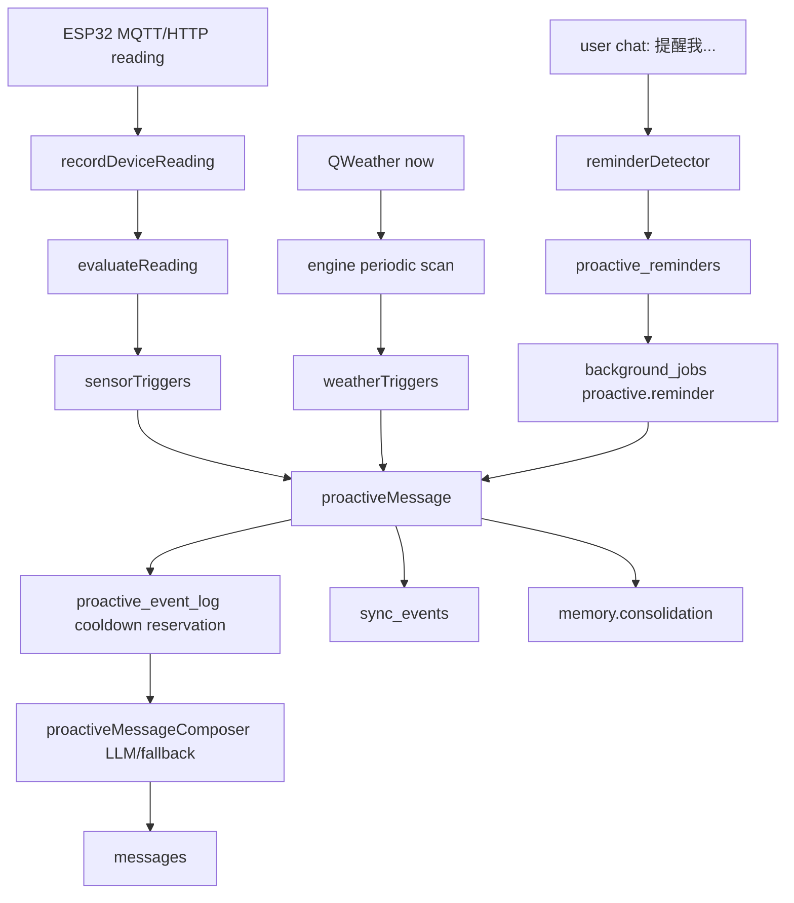

# Proactive Speech Engine

主动发言 Engine 让植物不只被动回答聊天，还能在环境、天气和主人自定义提醒发生时主动写入一条 `assistant` 消息，并通过已有 SSE 同步机制刷新桌面端。

## 目标

- 传感器异常主动发言：缺水优先，其次离线、过湿和其他环境异常。
- 天气主动发言：检测到实时天气为雨或降水量大于 0 时，提醒主人带伞。
- 主人提醒主动发言：用户在聊天里说“十分钟后提醒我浇水”等，系统解析为持久化提醒，到点后主动说话。
- 所有主动发言都走 `messages`、`sync_events` 和 memory consolidation，不新增独立前端通道。
- 用 `proactive_event_log` 做冷却去重，避免 1 秒级传感器上报导致重复刷屏。
- 事件只决定“该不该说”和“事实是什么”；LLM 只负责把结构化事实润色成植物口吻的一句话。

## 模块划分

```text
apps/server/src/config/proactive.ts
  读取主动发言配置，包括扫描间隔、传感器冷却、天气冷却和提醒最大跨度。

apps/server/src/modules/proactive/engine.ts
  服务启动时创建定时扫描器，周期检查传感器离线、到期提醒和天气。

apps/server/src/modules/proactive/sensorTriggers.ts
  复用 readings/rules 的 health 结果，把 soil_low、sensor_offline 等转换成 ProactiveEvent。

apps/server/src/modules/proactive/weatherTriggers.ts
  复用 weatherService 的 QWeather 实时天气，把雨/降水转换成带伞提醒。

apps/server/src/modules/proactive/reminderDetector.ts
  规则解析中文提醒表达，支持“十分钟后提醒我浇水”“明天早上8点提醒我带伞”等。

apps/server/src/modules/proactive/reminderRepository.ts
  持久化主人提醒，记录 scheduled/sent/cancelled 状态。

apps/server/src/modules/proactive/reminderJob.ts
  注册 background_jobs 的 proactive.reminder handler，到点后发送主动消息。

apps/server/src/modules/proactive/proactiveMessage.ts
  执行最终发言：先占用 event log 冷却，再写 messages，发布 sync event，更新 plant_status，调度记忆整理。

apps/server/src/modules/proactive/proactiveMessageComposer.ts
  在 LLM 可用时根据 ProactiveEvent.facts 润色主动发言；LLM 不可用、失败或测试运行时回落 event.content。

apps/server/src/modules/proactive/eventLogRepository.ts
  记录主动事件和按 event_key 做冷却判断。
```

## 数据流



## 触发策略

### 传感器

设备上报后立即评估一次，周期扫描也会补充检查离线状态。Engine 复用 `evaluateReading()`，所以阈值仍来自植物的 care profile。

优先级：

1. `soil_low`：土壤低于建议下限，主动说“我有点渴了”。
2. `sensor_offline`：超过离线阈值未收到新读数，主动说明不能再把旧读数当当前状态。
3. 其他 critical/warning issue：如过湿、温度异常、光照异常。

默认传感器冷却为 30 分钟，由 `PROACTIVE_SENSOR_COOLDOWN_MS` 控制。传感器离线是长时间持续状态，单独使用 `PROACTIVE_OFFLINE_SENSOR_COOLDOWN_MS`，默认 12 小时。

### 天气

Engine 周期调用 `getWeatherNow()`。如果天气文本包含雨类关键词，或 `precipMm > 0`，每个植物各发送一条带伞提醒。默认天气冷却为 6 小时，由 `PROACTIVE_WEATHER_COOLDOWN_MS` 控制。

天气 API 未配置时，扫描会安静跳过，不影响传感器和提醒。

### 用户提醒

聊天完成后解析用户消息。如果命中提醒表达，会写入 `proactive_reminders`，并排入 `background_jobs`。到点后 job handler 会写入一条植物主动消息：

```text
你让我提醒你：浇水
```

当前规则解析覆盖：

- `十分钟后提醒我浇水`
- `2小时后提醒我关窗`
- `明天早上8点提醒我带伞`
- `后天晚上7点提醒我浇水`

默认最多接受未来 30 天内的提醒，由 `PROACTIVE_REMINDER_MAX_DAYS` 控制。

## 配置

```env
PROACTIVE_ENABLED=true
PROACTIVE_LLM_ENABLED=true
PROACTIVE_SCAN_INTERVAL_MS=300000
PROACTIVE_SENSOR_COOLDOWN_MS=1800000
PROACTIVE_OFFLINE_SENSOR_COOLDOWN_MS=43200000
PROACTIVE_WEATHER_COOLDOWN_MS=21600000
PROACTIVE_REMINDER_MAX_DAYS=30
```

`PROACTIVE_ENABLED=false` 会关闭周期扫描和新读数触发，但已存在的 background job 仍会由通用 job worker 处理；如需完全停用提醒，应同时清理或暂停对应 job。

`PROACTIVE_LLM_ENABLED=false` 会保留事件触发、冷却、写入和同步，但主动消息直接使用规则模板，不调用 LLM 润色。

## 前端集成

前端不需要新增实时通道。主动发言写入 `messages` 后会发布：

```json
{
  "type": "messages.changed",
  "payload": {
    "proactive": true,
    "eventType": "sensor.soil_low"
  }
}
```

现有 Chat 页面收到同步事件后重拉消息即可显示。Dashboard 和详情页也会通过 `status.changed` 或 `readings.changed` 继续刷新状态。

## 可靠性边界

- 冷却基于 `plant_id + event_key`，适合单进程 SQLite 部署。
- LLM 润色前会先写一条 `proactive_event_log` 占用冷却窗口，避免连续读数在异步生成期间重复进入。
- `background_jobs` 负责提醒的失败重试和服务重启后的补跑。
- 周期扫描会补发到期提醒，避免 job 极端情况下遗漏。
- 当前天气只使用实时天气，不使用逐小时预报；如果要做到“未来两小时会下雨”，应新增 forecast client 和 forecast trigger。
- 当前提醒解析是规则型；到点后的主动发言可以走 LLM 润色，但提醒时间和提醒文本仍以结构化事实为准。

## 验证

已加入后端测试：

- 缺水读数会生成一次主动 assistant 消息，并在冷却期内去重。
- “十分钟后提醒我浇水”能解析为提醒，到点 job 会写入主动消息并标记 sent。

验证命令：

```powershell
npm run build --workspace @dyn/server
npm run test --workspace @dyn/server
```
